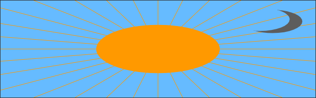
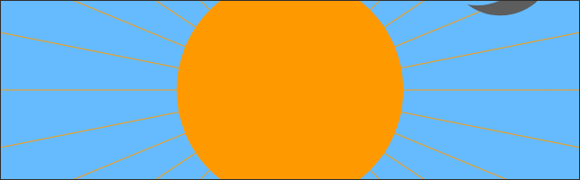
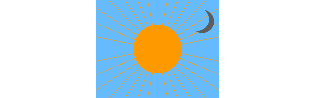
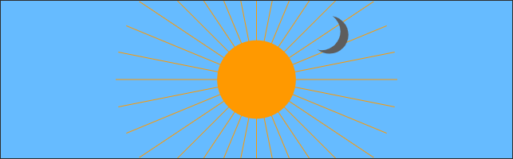

# svg-maximize
<b>SVG Maximize</b> is a utility for resizing the viewBox coordinate system of an inline SVG so that it covers the entire browser viewport (or a container element) <i>without</i> resizing the SVG's contents.

## Why is this a problem?
Inline SVGs are a powerful native tool for imaging and animation. However, browsers and devices come in all shapes and sizes while SVGs require fixed aspect ratio coordinate systems to ensure consistent rendering of the components. This leaves us with a few obvious options when scaling an image to a different aspect ratio using the `preserveAspectRatio` attribute of an SVG:

|  |
|:--:| 
| `none` - <b>Stretch the image independently on each axis.</b> This is rarely the intended outcome as the image completely changes. |

|  |
|:--:| 
| `xMidYMid slice` - <b>Cover the container element, maintaining the SVG aspect ratio.</b> This often results in clipping important information from our SVG. |

|  |
|:--:| 
| `xMidYMid meet` - <b>Contain the SVG within the container element, maintaining the SVG aspect ratio.</b> This is a pretty good solution in many cases, but it can leave unwanted blank margins around the SVG. Furthermore, since most SVGs contain a clipping mask around the viewbox, these margins aren't usable if you want to move (animate) the internal SVG elements into the blank regions. |

<i>Note: Amelia Bellamy-Royds gives a great primer on SVG scaling over at [CSS Tricks](https://css-tricks.com/scale-svg/).</i>

## We can do better!
Since SVGs are image instructions rather than a rendered image, we can modify the SVG to better suit our modified aspect ratio by scaling specific objects in the SVG differently than the SVG viewport.

|  |
|:--:|
| `xMidYMid slice` is still being used here, but with the help of this library, the viewbox is resized along with the background and the clipping mask. |

### Can't individual object scaling be accomplished by nesting SVGs with different `preserveAspectRatio` settings?
Yes! If you can appropriately break apart your SVG into sub-SVGs to control the element scaling and you have no need for complex animation, then that is a preferrable approach as no JavaScript is required to perform the resizing. Again, see the [CSS Tricks primer on SVG scaling](https://css-tricks.com/scale-svg/) for more information on the nested SVG approach.

This library exists to allow you to scale the SVG viewport while <i>selectively</i> scaling the internal SVG elements.
